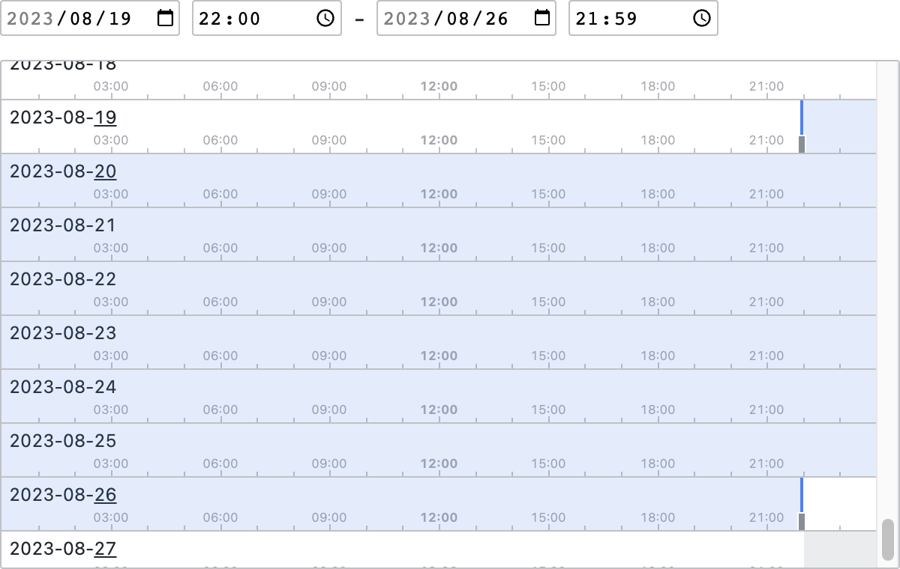

# Time Range Slider



该组件可以让用户在一个有限的时间范围内，非常方便地选取一个时间区间；基于 Vue 3 开发。

## 使用

安装：

```bash
# npm
npm install vue3-time-range-slider
# pnpm
pnpm install vue3-time-range-slider
# yarn
yarn add vue3-time-range-slider
```

使用：

```html
<template>
    <TimeRangeSlider v-model="sliderValue" :max="max" :min="min" step="minute" :limit="limit" />
</template>
<script lang="ts" setup>
import TimeRangeSlider from 'vue3-time-range-slider'
import 'vue3-time-range-slider/style.css'

const min = new Date(2023, 0, 1, 8, 0) // 2023-01-01 08:00
const max = new Date(2023, 0, 31, 17, 59) // 2023-01-31 17:59
const limit = 7 * 24 * 60 * 60 * 1000 // 7 days

const sliderValue = ref<[Date, Date] | undefined>(undefined)
</script>
```

## 属性

| 属性       | 描述                                       | 类型                                                  | 默认值     |
| ---------- | ------------------------------------------ | ----------------------------------------------------- | ---------- |
| modelValue | 用户所选取的时间区间                       | `undefined \| [Date \| undefined, Date \| undefined]` | -          |
| step       | 时间粒度                                   | `'second' \| 'minute' \| 'hour'`                      | `'second'` |
| min        | 时间选取范围的起始值                       | `Date`                                                | -          |
| max        | 时间选取范围的结止值                       | `Date`                                                | -          |
| limit      | 用户可选取的时间区间的最大长度，单位：毫秒 | `number`                                              | -          |

## 事件

| 事件              | 描述                                                                                                                                             | 参数                            |
| ----------------- | ------------------------------------------------------------------------------------------------------------------------------------------------ | ------------------------------- |
| update:modelValue | 当用户选取（或输入）一个时间区间后，将会触发该事件                                                                                               | `( value: [Date, Date] \| [] )` |
| change            | 同 update:modelValue 事件                                                                                                                        | `( value: [Date, Date] \| [] )` |
| startPicking      | 当用户开始选取时间时，将触发该事件                                                                                                               | -                               |
| picking           | 当用户选取时间时，将触发该事件（该事件会在 startPicking 触发后及 endPicking 触发前立即触发一次，而在这之间则会跟随用户的鼠标移动等操作触发多次） | -                               |
| endPicking        | 当用户选取完一个时间区间后，将触发该事件                                                                                                         | -                               |

## 时间区间

在该组件中，「时间区间」被认为是一个相对于 `step` 的闭区间，比如当 step 为 `hour` 时，下面这个区间值：

```
[2022-01-01 00:00:00, 2022-01-01 12:00:00]
```

表示是「2022 年 1 月 1 日」这一天中的从「0 点」到「12 点」这共计 13 个小时的时间。

而：

```
[2022-01-01 00:23:30, 2022-01-01 12:59:59]
```

则与上例一样，同样表示的是「2022 年 1 月 1 日」这一天中的从「0 点」到「12 点」这共计 13 个小时的时间。

至于：

```
[2022-01-01 00:00:00, 2022-01-01 00:00:00]
```

则表示的是「0 点」这一个小时的时间。

## 注意

首先，该组件只能让用户在一个有限的时间范围内进行选择，且时间范围不应太长（尽量在三个月内，若需要更长时间，可以提 Issue 或 PR）。

另外，允许用户可选取的时间区间的最大长度不应太长，尽量确保最大长度（通常是天数）不超过面板视口能够完整显示的天数。

最后，组件的宽高度最好设为 `735 x 350`，可在此基础上适当缩减，但最好不好缩减太多。
